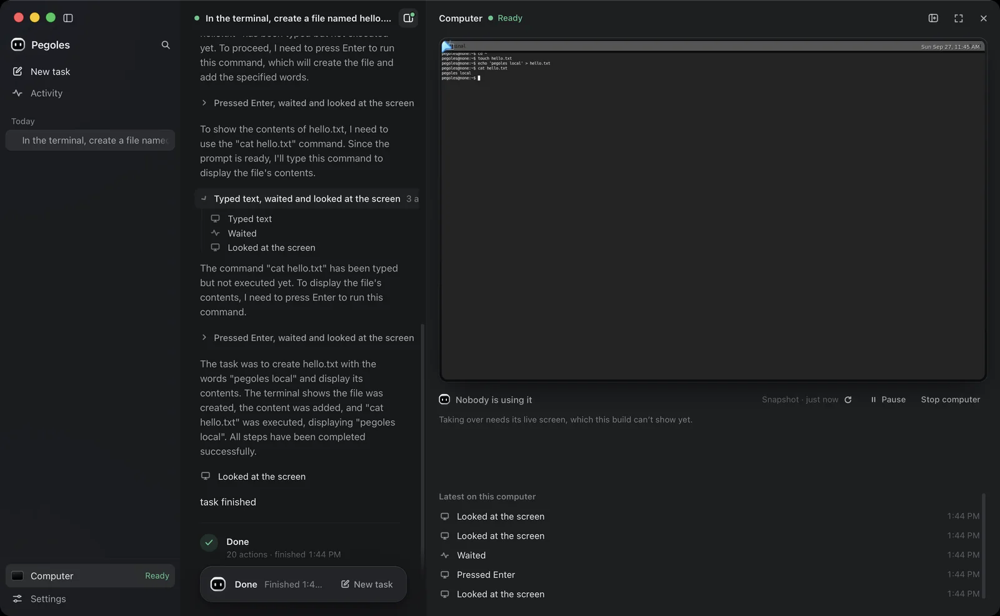
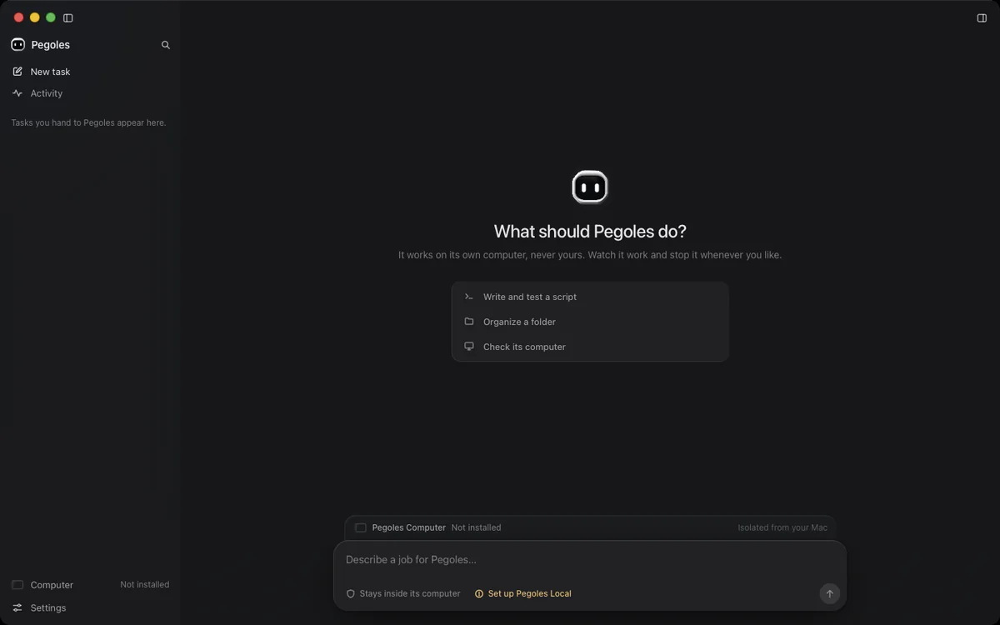
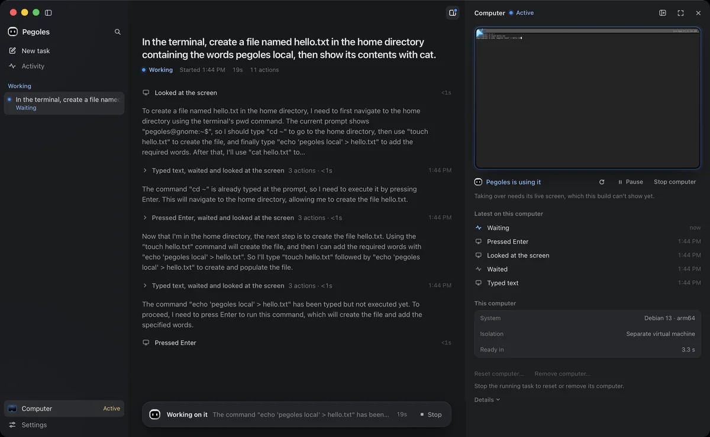
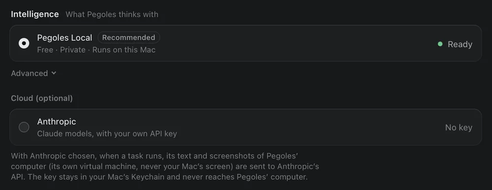
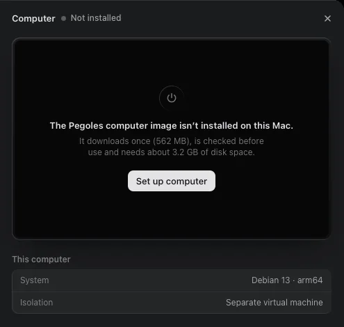

<p align="center">
  
</p>

<h1 align="center">Pegoles Agent</h1>

<p align="center">
  <b>AI gets its own computer. Not your computer.</b><br>
  A computer-use agent for macOS: a model on your Mac operates an isolated
  Linux VM, and every action it proposes passes a deterministic policy.
</p>

<p align="center">
  
</p>

## Quick start

Needs a Mac with Apple silicon, macOS 14 or later, the Xcode Command Line
Tools (`xcode-select --install`) and about 8 GB of free disk space for
the build.

```bash
git clone https://github.com/zezortdx/Pegoles-Agent.git
cd Pegoles-Agent
git checkout v0.1.0
./scripts/install.sh
```

This builds the 0.1.0 release from source on your Mac and installs
`~/Applications/Pegoles.app` (about 5 minutes on an M4 Pro on the first
run). The build tools (Rust, Node.js, pnpm, the model runtime) are
downloaded into the checkout's `target/` directory, each pinned by version
and checksum; nothing is installed system-wide (package managers only use
their usual per-user caches), and there is no sudo. The installed app does
not use the checkout: you can delete it afterwards.

Then open Pegoles and:

1. choose **Set up computer**: downloads the 562 MB computer image once and
   checks it against digests built into the app;
2. set up **Pegoles Local** (Settings → Intelligence): downloads the 2.2 GB
   model once, pinned and checked the same way;
3. describe a task. No API key and no account are needed; the model runs
   on your Mac.

Pegoles is distributed as source for now: there is no Apple-notarized
download yet. The app you build is signed ad hoc on your own Mac, so
Gatekeeper is not involved and nothing is turned off. To uninstall, delete
`~/Applications/Pegoles.app` and, if you like,
`~/Library/Application Support/Pegoles`.

## Why Pegoles

- **Its own computer.** The agent works in a Linux virtual machine
  (Apple's Virtualization.framework) with no network device, no shared
  folders and no clipboard. It never sees or touches your Mac's files,
  apps or screen. Reset returns the VM to its sealed image.
- **Local by default.** The default planner, Pegoles Local, is a small
  vision-language model (MAI-UI-2B, 6-bit, on MLX) running on your Mac in
  a sandboxed process with no network access. After the one-time
  downloads, tasks run offline. A cloud planner (Claude, with your own
  Anthropic API key) is optional.
- **Typed actions, deterministic policy.** A model can only propose
  observe, point, type, press-key and wait actions; there is no shell,
  file, process or URL action anywhere in the protocol. Every action
  passes an exhaustive, deterministic policy and an executor before it
  reaches the VM, and you can stop a run at any time.
- **Verified inputs.** The app boots only the computer image, and loads
  only the model files, whose digests are compiled into it.

## Screenshots

| | |
|---|---|
|  |  |
| **Home.** Describe a task for the agent's computer. | **A task with Pegoles Local.** Its narration and each action beside the VM's screen, where the agent's cursor shows each click. |
|  |  |
| **Pegoles Local.** The pinned model, downloaded and verified in the app. | **Set up computer.** The sealed image, downloaded and verified once. |

## Status

First public release, **0.1.0**, installed from source.

| | |
|---|---|
| Platform | macOS on Apple silicon only. Built for macOS 14 or later; tested on macOS 26.5 only. No Windows or Linux host support. |
| Hardware tested | One Mac: M4 Pro, 24 GB. Pegoles Local peaks at about 4.5–5 GB of memory (model worker ≈ 4 GB, VM ≈ 0.5 GB). Smaller Macs are untested; no minimum RAM is claimed yet. |
| Disk | About 6 GB after setup: the app (≈ 0.5 GB), the computer image (3 GB installed) and the model (2.2 GB); the build needs about 8 GB while it runs (5 GB measured). |
| Distribution | Source install (`scripts/install.sh`). No Developer ID signature or Apple notarization yet; an official signed download is planned. |

What works, verified on real hardware: the VM boots from the sealed image
in a few seconds; the agent clicks, types, presses keys, scrolls, drags
and looks at the screen through the policy; Stop cancels a run within
milliseconds to about 3 s; reset returns the machine to the sealed image;
Pegoles Local completes short, concrete tasks with no API key (17 of 22
goals on the real-VM benchmark, [details](benchmarks/local-models/README.md)).
The evidence for each release gate is in
[docs/RELEASE_GATES.md](docs/RELEASE_GATES.md).

### Windows (in development, not released)

A Windows 11 x64 version is being built on the `phase/windows-0.2`
branch with the same design: Hyper-V's Host Compute System (works on
Home with the Virtual Machine Platform feature, which onboarding helps
turn on), a small privileged service that only creates Pegoles' VMs, an
offline Debian guest, and Pegoles Local on llama.cpp (Vulkan or CPU) in
an AppContainer sandbox. On GitHub's Windows Server runners it builds,
passes its tests, installs, boots its own x64 guest through Hyper-V, and
the agent operates that guest end to end (clicks, typing, screenshots,
policy, cancel, recovery), but **it has not run on a Windows PC yet**,
its guest image is not published, and there is no Windows download. The GGUF model path it uses scored 17 of 22 on the
same real-VM benchmark on a Mac, like the MLX default. Status and
evidence: [docs/PLATFORM_MATRIX.md](docs/PLATFORM_MATRIX.md),
[docs/WINDOWS_ARCHITECTURE.md](docs/WINDOWS_ARCHITECTURE.md).

## Security model, briefly

A model is an untrusted planner, local or cloud alike. Its output is
parsed strictly into typed actions; every action passes the policy and
Core's executor and lands in a VM with no network device. The local model
runs in its own sandboxed process (no network, no other processes, nothing
in your home folder beyond its model and runtime). The desktop webview can
call only the commands the UI needs, has no network access, cannot
navigate away, and cannot switch you to a cloud planner or store a key
without a native macOS confirmation.

- Architecture: [docs/ARCHITECTURE.md](docs/ARCHITECTURE.md)
- Design and enforcement: [docs/SECURITY.md](docs/SECURITY.md)
- Threats, controls and residual risks: [docs/THREAT_MODEL.md](docs/THREAT_MODEL.md)
- What leaves your Mac: [docs/PRIVACY.md](docs/PRIVACY.md) (nothing, with
  Pegoles Local, after the one-time downloads)
- Reporting vulnerabilities: [SECURITY.md](SECURITY.md)

## Known limitations

- Source install only; not Developer ID signed or notarized. Tested on
  one Mac (M4 Pro, 24 GB, macOS 26.5).
- The agent's computer has no network: no web browsing, downloads or
  package installs inside the VM.
- No access to your Mac's files, screen or apps, by design.
- No human-controllable live view of the VM yet: you see its screen and
  the agent's narration, but cannot take over with your own mouse and
  keyboard.
- Pegoles Local is a 2-billion-parameter model: it completes short,
  concrete tasks and gets some wrong; budgets and a loop brake stop
  runaway runs.
- The Claude planner is unit-tested but was not run against the live API
  for this release.
- No auto-update: for a new version, `git fetch --tags`, check out its
  tag and run `./scripts/install.sh` again. Task history is kept in
  memory only.

## Development

See [CONTRIBUTING.md](CONTRIBUTING.md) for the development setup, the
gates (`bash scripts/check.sh`), the hardware end-to-end tests and the
guest image loop.

```text
apps/desktop               Tauri 2 shell (Rust commands, ACL) + React UI
crates/pegoles-agent       runner, budgets, planners (local, Claude, scripted), local-model parser
crates/pegoles-inference   hardware probe, pinned model store, sandboxed MLX worker supervisor
crates/pegoles-core        computer registry, executor (policy → control → input), tasks, events
crates/pegoles-policy      deterministic action policy
crates/pegoles-protocol    shared types (actions, events, tasks, limits, text rules)
crates/pegoles-computer    macOS VM engine, guest session, pinned image distribution
crates/pegoles-guest-proto host ↔ guest protocol (JSONL over vsock)
guest/runtime              Linux guest runtime (vsock, uinput, weston capture)
native/macos               Swift VM helper (Virtualization.framework)
workers/mlx                the model worker (Python, sandboxed, offline) and its lock
scripts/                   installer, gates, packaging, release, runtime and image builders
```

## License

MIT (see [LICENSE](LICENSE)). The app redistributes third-party
components (the Python runtime, MLX and other packages, frontend
libraries, Rust crates) under their own licenses; the built app carries
the full inventory in `Contents/Resources/THIRD_PARTY_NOTICES.md`.
