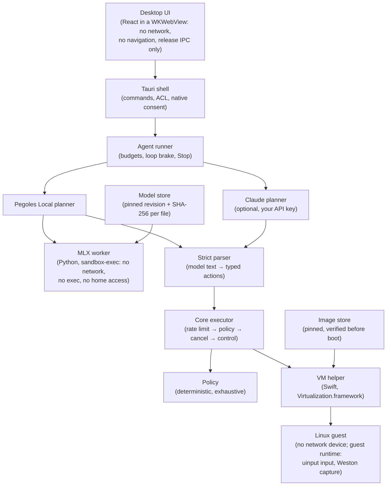

# Architecture

> **AI gets its own computer. Not your computer.**

Pegoles is a macOS app (Tauri 2, Rust + React) that lets a model operate
a separate Linux virtual machine. The model never receives a tool that
touches your Mac: it can only propose typed pointer, keyboard, wait and
observe actions, and every one of them passes a deterministic policy and
an executor before it reaches the VM. This page is the map; the security
reasoning is in [SECURITY.md](SECURITY.md) and
[THREAT_MODEL.md](THREAT_MODEL.md).

## Flow of one step

1. The runner asks the planner for the next step, with the latest
   screenshot of the VM and the task text.
2. **Pegoles Local** sends the prompt to the MLX worker, a separate,
   sandboxed Python process that loads the pinned model and returns text.
   The text is parsed by `crates/pegoles-agent/src/local/parse.rs` into
   typed `ComputerAction`s; anything else is an error the model sees.
   The optional Claude planner returns tool calls that map to the same
   types.
3. Each action goes to Core's executor: rate limit, then
   `pegoles-policy::evaluate` (an exhaustive match over the action types,
   with bounds and text rules such as refusing key material), then a
   cancellation check, then the VM control channel.
4. The VM helper forwards input to the guest runtime over vsock; the
   guest injects it with uinput and returns frames from the Weston
   compositor.
5. Budgets (turns, actions, time, failed turns) and a loop brake end
   runaway runs; Stop cancels between and during actions.

## Components

| Component | Where | Responsibility |
|---|---|---|
| Protocol | `crates/pegoles-protocol` | Shared types: `ComputerAction` (observe, pointer, keyboard, wait; no shell, file, process or URL action exists), events, tasks, limits, text rules. |
| Policy | `crates/pegoles-policy` | Deterministic allow/deny per action; no model involved. |
| Core | `crates/pegoles-core` | Computer registry, the executor, input and display handling, tasks, event bus. |
| Agent | `crates/pegoles-agent` | Runner (budgets, loop brake, Stop), planners (Pegoles Local, Claude, scripted for tests), prompt building and the strict local-model parser. |
| Inference | `crates/pegoles-inference` | Hardware probe, pinned model catalog and store (resumable download, per-file SHA-256, atomic install), and the supervisor of the sandboxed MLX worker. |
| Computer | `crates/pegoles-computer` | macOS VM engine (drives the Swift helper over JSON Lines), guest session, pinned image catalog, image download and verification. |
| Guest protocol | `crates/pegoles-guest-proto` | Host ↔ guest JSON Lines over vsock, 64 KiB frames, handshake per connection. |
| Guest runtime | `guest/runtime` | Runs inside the VM: input via uinput, frame capture from Weston. |
| VM helper | `native/macos/pegoles-vm-host` | Swift executable that owns `VZVirtualMachine`; the only binary with the virtualization entitlement. |
| MLX worker | `workers/mlx` | Python model worker, run by the bundled CPython under `sandbox-exec` with a cleared environment. |
| Desktop | `apps/desktop` | Tauri commands (release set enforced through Tauri's ACL), native consent prompts, and the React UI. |

## Decisions that shape the code

- **Every planner is untrusted.** Local and cloud planners sit behind the
  same `Planner` trait, the same parser discipline and the same policy.
- **Guest data is hostile.** Every field from the guest is bounded; the
  app never panics on it and never holds its lock while waiting on it.
- **Verified inputs only.** The app boots only the image whose archive
  and disk digests are compiled into it, and loads only model files
  whose digests are compiled into it, re-checking before use.
- **The webview is contained.** It has no network access (a WebKit
  content rule list blocks every network and `file:` load; WebRTC is
  removed), cannot navigate away, and can call only the commands the UI
  needs. Switching to the cloud planner or storing an API key requires a
  native macOS confirmation.
- **State lives on the host, under the data directory.** Images, models,
  computers and settings live in `~/Library/Application Support/Pegoles`;
  the model key lives in the Keychain. Task history is in memory only.
- **Everything the app runs is inside the bundle.** The installed
  `Pegoles.app` carries its Python runtime, worker and helper; it never
  uses the source checkout it was built from.

## Platform

macOS on Apple silicon is the only supported host. The portable crates
also build and test on Linux and Windows in CI, and a Windows backend
skeleton exists (`native/windows`), but it has never run and is not
supported.
