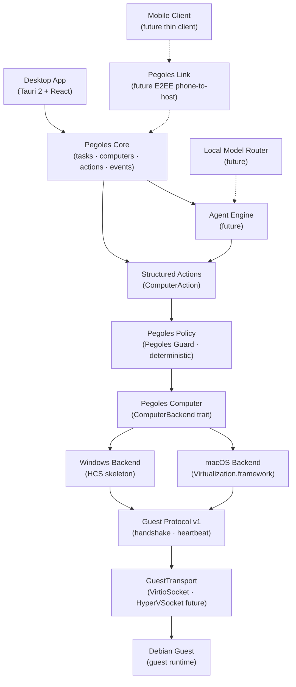

# Architecture

Phase 3.5: Windows-ready portability. The rule governing every decision:

> **AI gets its own computer. Not your computer.**

## Layers

| Layer | Crate / dir | Responsibility |
|---|---|---|
| Protocol | `crates/pegoles-protocol` | Serializable types only. No logic. Travels desktop↔core↔computer↔guest (local today, network later). |
| Policy | `crates/pegoles-policy` | Deterministic `Allow / Deny / RequireApproval`. No AI. |
| Computer | `crates/pegoles-computer` | `ComputerBackend` trait + `MockComputerBackend` + real `MacOSVirtualizationBackend` (child-process `pegoles-vm-host`, JSON Lines) + `WindowsHcsBackend` skeleton + `ComputerImageManager` + `GuestSession` + `GuestTransport` + `platform` (enums, paths, factory, host caps). |
| Core | `crates/pegoles-core` | `TaskManager`, `ComputerRegistry`, `EventBus`. In-memory in Phase 1. |
| Desktop | `apps/desktop` | Tauri commands (thin) + React rendering. No core logic in TS. |
| UI tokens | `packages/ui` | Colors, spacing, typography, surface primitives. |
| macOS native | `native/macos/pegoles-vm-host` | SwiftPM executable owning `VZVirtualMachine`; lifecycle + vsock transport only; closed command set (`docs/VM_HOST_PROTOCOL.md`). |
| Windows native | `native/windows/pegoles-vm-host` | Rust skeleton (same JSONL command set shape); HCS wiring is future. |

## Key decisions

1. **Core owns state.** React calls `invoke()` and renders. Buttons reflect `get_status()` truth, never local guesses.
2. **Events flow one way.** Registry/TaskManager → `EventBus` (broadcast) → Tauri `pegoles://event` → timeline. `list_events` is the polling fallback and history source.
3. **Backend indirection.** Core depends on `Box<dyn ComputerBackend>`, built only by `platform::create_backend()`. Registry selects Mock vs real by platform (`PEGOLES_BACKEND=mock` forces Mock). A real-backend failure surfaces as an error, never a silent Mock fallback.
4. **Computer ≠ instance.** The computer (`ComputerId`) is persistent; each `start()` mints an ephemeral `ComputerInstance` (new native handle, cleared on stop). HCS parity: compute systems die on stop while the computer lives on.
5. **Mobile-ready, mobile-absent.** Protocol is serde JSON; agent state lives in Core on the host; the phone will be a thin client over Pegoles Link (E2EE). Nothing in this phase blocks that.
6. **Persistence deferred.** In-memory registries by explicit decision (see plan). SQLite insertion point: replace `HashMap` stores in `pegoles-core` + persist `event_log`; protocol unchanged.
7. **VM data layout.** All host-side VM state lives under the platform data root (`PegolesPaths`: `~/Library/Application Support/Pegoles/`, `%LOCALAPPDATA%\Pegoles\`, XDG on Linux) as `images/` + `computers/<id>/`; never the repo, never Desktop/Documents. The verified base raw is read-only; each computer gets a private disk copy.
8. **Protocol above transport.** Guest Protocol v1 (handshake/heartbeat) runs over `GuestTransport` (`VirtioSocketTransport` on macOS, `HyperVSocketTransport` future, fakes in tests). Transports move opaque frames; they never parse protocol and never survive lifecycle by contract — the session reconnects.
9. **Portability is gated.** Shared crates stay platform-free (tripwire tests); Windows+Linux CI jobs compile and test everything portable; `cargo check` on Windows blocks macOS-only regressions.
