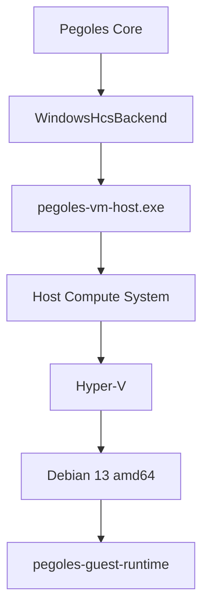

# Windows Backend (HCS implementation — Phase 3.6)

> **Superseded (2026-09-27).** This describes the Phase 3.6 design (Windows Pro, the Hyper-V role, Hyper-V Administrators membership, a registry socket registration). The current design is in `docs/WINDOWS_ARCHITECTURE.md` (Host Compute System with only the Virtual Machine Platform, a small broker service, the guest runtime listening on vsock 850, an image provisioned at build time by `scripts/build-guest-image/build-x64.sh`). Kept for history.

Target #1: **Windows 11 Pro, x86_64**, Hyper-V enabled. Not Home (needs a
separate WHP backend — research only, see below). Not ARM64 Windows yet
(architecture stays possible: `GuestArchitecture::Arm64` ≠ Mac).

Status honesty: IMPLEMENTED + unit-tested where hardware-independent,
CI-compiled on Windows, **behavior on real hardware NOT verified** (no
Windows machine in this phase). See PLATFORM_MATRIX.md tiers.



Control plane (same Guest Protocol v1, different transport):

```text
Core
↓
HyperVSocketTransport
↓
AF_HYPERV (SOCK_STREAM, HV_PROTOCOL_RAW)
════════ VM boundary ════════
AF_VSOCK (SOCK_STREAM)
↓
Guest Runtime (same binary concept)
```

## Lifecycle (HCS semantics: compute systems are ephemeral)

```text
Prepare disk (.vhdx copy)
↓
Prepare HCS configuration
↓
Create Compute System      (HcsCreateComputeSystem)
↓
Start                      (HcsStartComputeSystem)
↓
Running
↓
Pause / Resume             (HcsPauseComputeSystem / HcsResumeComputeSystem)
↓
Shutdown                   (HcsShutDownComputeSystem)
↓
Compute System disposed — handle DEAD, Pegoles Computer identity lives on
```

Restarting creates a NEW compute system for the SAME `ComputerId`.
This is why Phase 3.5 splits persistent computer identity from the
ephemeral `ComputerInstance`: the macOS backend mints a fresh instance
id per start today for exactly this parity.

Future forced stop maps to `HcsTerminateComputeSystem`. State maps to
`HcsGetComputeSystemProperties` + event callbacks.

## Operations mapping

| Pegoles | HCS |
|---|---|
| create | prepare persistent resources (disk copy, config JSON) |
| start | HcsCreateComputeSystem + HcsStartComputeSystem |
| pause / resume | HcsPause* / HcsResume* |
| stop (graceful) | HcsShutDownComputeSystem |
| forced stop (future) | HcsTerminateComputeSystem |
| state | HcsGetComputeSystemProperties + callbacks |
| destroy | delete persistent resources |

The Rust↔helper JSONL command set does NOT change (`version/validate/
create/start/pause/resume/stop/state/destroy` + `guest_send/
guest_status/guest_disconnect`); backend specifics travel in
capabilities/optional fields. There will never be `windowsStart`.

## Explicitly out of scope for the HCS backend

HCS can create processes inside compute systems. Pegoles will NOT use
that as an LLM shortcut — it would break the security model. The flow
stays: Model → Structured Action → Policy → Guest Protocol → Guest
Runtime → guest action. Never Model → Windows host process.
(Also: no PowerShell automation, no Hyper-V Manager GUI, no WMI scripts
— HCS has a proper API. Locked by `direction_tests`.)

## Storage

`%LOCALAPPDATA%\Pegoles\` (`PegolesPaths::for_platform(Windows)`):

```text
Pegoles/
  images/
  computers/<computer-id>/
    metadata.json
    disk.vhdx
    logs/
```

VHDX via Windows Virtual Disk APIs at builder/runtime time. No QEMU,
VirtualBox, VMware, or Docker required by the runtime. The builder may
produce the artifact separately (like today's tar.xz→raw flow).

## Hyper-V socket transport (implemented, hardware-unverified)

- Windows host: `AF_HYPERV`, `SOCK_STREAM`, `HV_PROTOCOL_RAW`
  (`native/windows/pegoles-vm-host/src/hvsock.rs`: manual Winsock FFI,
  listener bound to VMID + service GUID, accept/pump threads, 64 KiB
  framing shared with the unit-tested pump).
- Linux guest: `AF_VSOCK`, `SOCK_STREAM` (unchanged binary concept).
- Service identity: well-known VSOCK template GUID
  `00000000-facb-11e6-bd58-64006a7986d3` (Microsoft, "Make your own
  integration services") with Data1 = port: `hyperv_service_guid_for_port`
  (tested: 2761 → `00000AC9-…`, our 4050 → `00000FD2-…`).
- Registration in
  `HKLM\…\Virtualization\GuestCommunicationServices` is a one-time
  PRIVILEGED installer step (`pegoles-windows-setup register`, verify
  after write); runtime only verifies (`WINDOWS_SETUP.md`).
- Same Guest Protocol v1 above it (`GuestTransport` trait — the
  `session_runs_above_hyperv_shaped_transport` test proves the session
  runs unchanged); same reconnect contract (pause may kill the channel;
  session re-handshakes).

## Debian image for Windows

Logical image "Pegoles Base Image v0.1" gained its second artifact
(`docs/WINDOWS_IMAGE.md`): official Debian 13 generic amd64, SHA-512
verified, converted to dynamic VHDX by build tooling only, kernel-gated
(`vsock`/`virtio_vsock`/`hyperv_vsock` all modules → universal), own
sha512 recorded in the manifest. State: UNPROVISIONED (no guest runtime
inside — blind filesystem surgery refused); first boot on Windows
hardware provisions via the seed-ISO flow and seals a provisioned VHDX.
No amd64 runtime binary is missing: cross-build via Docker is documented
in `scripts/build-guest-image/`.

## Host probe (real detection, honest Unknowns)

`probe_windows_host()` fills every item it can prove with OS APIs and
leaves the rest `None`: registry version/edition, `IsProcessorFeaturePresent`
firmware VT flag, vmms service existence/state via SCM, ComputeCore.dll
load test, our GUID subkey read, Administrators + Hyper-V Administrators
(S-1-5-32-544/578) token checks, reboot markers. `classify()` turns
evidence into the 10 user-facing states; `pegoles-windows-setup check`
prints them. Behavior on hardware is unverified — the code paths are
reviewed against docs, compile-gated on Windows CI, and each call fails
closed to Unknown independently.

## Privileges (least privilege)

One-time privileged install/setup (socket service registration, Hyper-V
Administrators membership check), then unprivileged runtime. Never run
all of Pegoles as Administrator; never silently change group
membership. Capability probe reports per-item status
(`WindowsHostCapabilities`); the UI shows exactly what's missing.

## WHP is not HCS (explicit non-goal)

- **HCS**: Windows' VM management stack (this backend's API).
- **WHP** (Windows Hypervisor Platform): lower-level hypervisor API for
  a possible future `WindowsWhpBackend` (e.g. for Home, research-only).
  It will be a SEPARATE backend reusing no HCS assumptions. Not designed
  further here.
